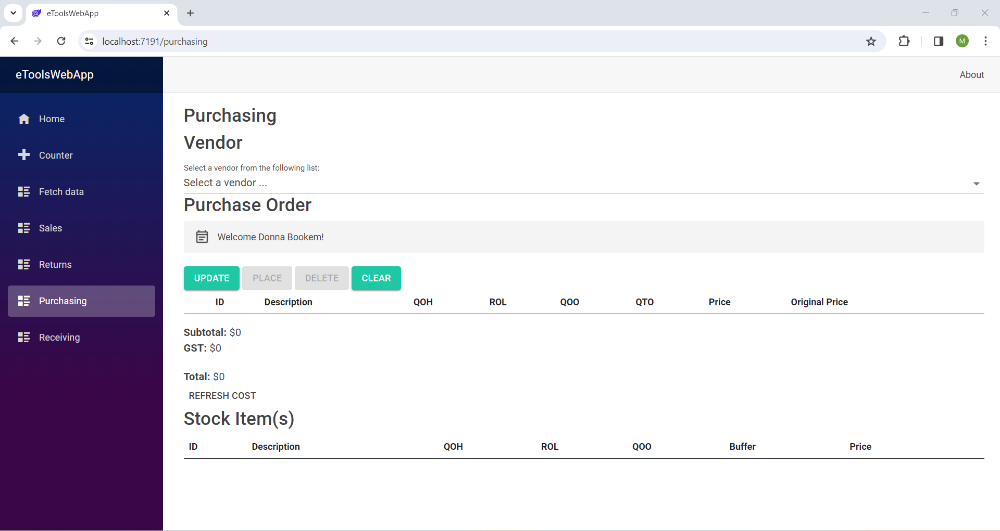

<h2>HEY THERE,</h2>
<h1>I'm Mark.</h1>

I'm an upcoming NAIT graduate that enjoys creating apps that solve problems and learning about all things software.
Welcome to my portfolio. I'm glad to see you

My Skills

<ul>
    <li></li>
</ul>
